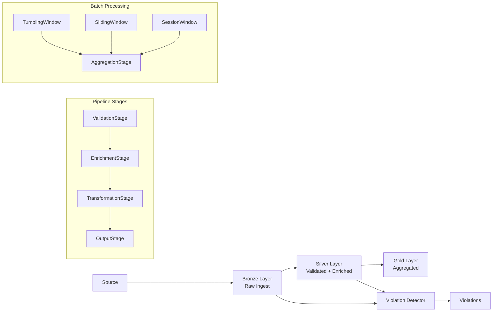

# stream-etl-engine – Streaming ETL & Violation Detection Pipeline

Stage-based streaming ETL framework with violation detection, delta analysis, and data lake layer processing. Java 21, Spring Boot 3.

## Use Cases

- **Compliance monitoring** – detect regulatory violations in real-time data streams (e.g., threshold breaches, regulatory rule checks)
- **Data quality** – validate, clean, and enrich records as they flow through processing stages
- **Supply chain** – track state changes across snapshots, detect discrepancies between declared and actual values
- **Financial** – windowed aggregation for fraud pattern detection, threshold breach alerting

## Architecture



## Tech Stack

| Layer | Technology |
|---|---|
| Runtime | Java 21 |
| Framework | Spring Boot 3.2 |
| Patterns | Sealed interfaces, Records, Pattern matching, Layered architecture |
| Build | Gradle 8 (Kotlin DSL) |
| Boilerplate | Lombok |
| Testing | JUnit 5, AssertJ, MockMvc |

## API Layer

```
Controller → Mapper → Service → Domain (model, pipeline, violation, datalake, delta, window)
```

- **Controller** - thin pass-through, validation only
- **Mapper** - domain ↔ DTO conversion
- **Service** - orchestration, business logic
- **Domain** - core model, pipeline stages, violation rules, window functions

## Pipeline DSL

```java
EtlPipeline pipeline = PipelineBuilder.create()
    .validate("id", "price")
    .enrich("categoryCode", code -> Map.of("category", lookupService.resolve(code)))
    .enrichFromMap("region", referenceData)
    .transform(TransformationStage.builder()
        .rename("old_name", "new_name")
        .toDecimal("price")
        .trim("description")
        .build())
    .output(record -> sink.send(record))
    .build();

Record result = pipeline.process(record);
```

## Window Aggregation

Window functions operate on batches of records and are used independently from the per-record pipeline:

```java
TumblingWindow window = TumblingWindow.of(Duration.ofMinutes(5));
List<List<Record>> windows = window.apply(records);

WindowAggregator aggregator = new WindowAggregator();
List<AggregateStats> stats = aggregator.aggregateWindows(windows, "price");
```

## Violation Rules

```java
ViolationRule rule = new ViolationRule(
    "price-ceiling",
    "price",
    Operator.GREATER_THAN,
    new BigDecimal("9999.99"),
    ViolationSeverity.CRITICAL
);
List<Violation> violations = detector.detect(record, List.of(rule));
// violation.field() → "price", violation.actualValue() → 10000.00
```

## Delta Analysis

Compare two records or entire snapshots to detect field-level changes:

```java
DeltaAnalyzer analyzer = new DeltaAnalyzer();
List<DeltaResult> deltas = analyzer.compare(previousRecord, currentRecord);
// → [DeltaResult{MODIFIED, "price", 100, 150}, DeltaResult{ADDED, "discount", null, 10}]

List<DeltaResult> snapshotDiff = analyzer.compareSnapshots(oldSnapshot, newSnapshot, "id");
```

## Data Lake Layers

| Layer | Description |
|---|---|
| BRONZE | Raw records as received, no transformation |
| SILVER | Validated, cleaned, enriched |
| GOLD | Aggregated, analytics-ready |

## REST API

### Process record
```
POST /api/v1/pipeline/process?sourceId=api
Body: {"payload": {"id": "1", "name": "test"}}
```

### Detect violations
```
POST /api/v1/pipeline/detect-violations?sourceId=api
Body: {"payload": {"price": -10, "quantity": -5}}
```

### Promote to layer
```
POST /api/v1/pipeline/promote?sourceId=api&targetLayer=GOLD
Body: {"payload": {"id": "1", "value": 42}}
```

### Health check
```
GET /api/v1/pipeline/health
```

## Configuration

```properties
stream-etl.violation.default-severity=WARNING
stream-etl.window.default-size-seconds=300
stream-etl.datalake.auto-promote=true
```

## Running

```bash
./gradlew bootRun
```

## Testing

```bash
./gradlew test
```
---

## Release Status

**1.0.0** - Initial stable release.

---

## License

MIT - see [LICENSE](./LICENSE)
